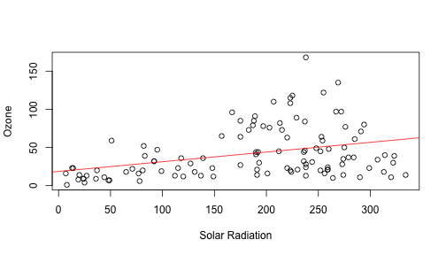

## What is this application?

This application uses the airquality dataset from the R datasets package and allows the user to do two things:

1. Plot relationships between the different variables measured in the dataset.
2. Make predictions for any single variable given a value for any other single variable using linear regression.


```r
library(datasets)
head(airquality)
```

```
##   Ozone Solar.R Wind Temp Month Day
## 1    41     190  7.4   67     5   1
## 2    36     118  8.0   72     5   2
## 3    12     149 12.6   74     5   3
## 4    18     313 11.5   62     5   4
## 5    NA      NA 14.3   56     5   5
## 6    28      NA 14.9   66     5   6
```

---  

## First Feature: Plotting Relationships

The application allows the user to select one of the four measured variables and then plot it against any of the three remaining variables.  A linear model then automatically fits a regression line for the selected relationship.  This example shows Solar Radiation plotted against Ozone.


```r
fit <- lm(Ozone~Solar.R, data=airquality)
plot(Ozone~Solar.R, data = airquality, xlab="Solar Radiation", ylab="Ozone")
abline(fit, col="red")
```

 

---  

## Second Feature: Making Predictions

After a user has selected the two variables they would like to compare (the predictor and the outcome), they can user the slider to find the predicted outcome based on a given predictor value.  The slider calculates a prediction based on the coefficients obtained for the linear model that is fitted to the plot.


```r
sliderInput <- 150
fit <- lm(Ozone~Solar.R, data=airquality)
slp <- fit$coeff[2]
yint <- fit$coeff[1]
prediction <- round(yint + slp * sliderInput,2)
prediction
```

```
## (Intercept) 
##       37.67
```

---

## Why Should We Build and Use This Product?

This product can be very useful for performing exploratory data analysis, especially for those individuals that are less familiar with R.  Even for those that are serious programmers this provides a way to analyze the relationships between the variables in this dataset very quickly without writing a single line of code!
